# Trabajo Práctico Nº1: Rendimiento - Sistemas de Computación

## **1️⃣ Objetivo**

El objetivo de este trabajo práctico es aplicar conocimientos sobre performance y rendimiento de los computadores en situaciones prácticas. Se busca:

  **1.** Evaluar y seleccionar benchmarks apropiados para diferentes tareas computacionales, con énfasis en aquellos relevantes para actividades diarias.

  **2.** Analizar el rendimiento de diferentes procesadores en tareas específicas como la compilación del kernel de Linux.

  **3.** Medir el rendimiento de código propio en una ESP32, variando la frecuencia de reloj y observando su impacto en el rendimiento.

  **4.** Profiling y análisis de rendimiento del código. 

---

## **2️⃣ Ejercicio 1: Benchmarks**

### **🔹 2.1 Lista de benchmarks útiles**

A continuación, se detallan algunos benchmarks relevantes según distintos tipos de pruebas:

- **CPU:**
  - SPEC CPU
  - Geekbench
  - Cinebench
  - Phoronix Test Suite

- **Memoria:**
  - STREAM
  - Memtest86

- **Almacenamiento (Discos):**
  - CrystalDiskMark
  - fio

- **Compilación de código:**
  - Phoronix Test Suite - Build Kernel

- **Gaming y gráficos:**
  - 3DMark
  - Unigine Superposition

- **IA y cálculo científico:**
  - TensorFlow Benchmark
  - LINPACK

### **🔹 2.2 Tareas diarias y benchmarks correspondientes**

| **Tarea**                   | **Benchmark recomendado**        |
|-----------------------------|---------------------------------|
| Compilación de código       | Phoronix Test Suite - Build Kernel |
| Desarrollo de software      | SPEC CPU, Geekbench            |
| Análisis de datos           | LINPACK, TensorFlow Benchmark  |
| Edición de video            | Cinebench, 3DMark              |
| Juegos                      | 3DMark, Unigine Superposition  |
| Uso general (navegación) | Geekbench, PCMark       |

---

## **3️⃣ Ejercicio 2: Evaluación del rendimiento de diferentes procesadores en la compilación del kernel de Linux**

### **🔹 3.1 Rendimiento en la compilación del kernel de Linux**

Se evaluará el rendimiento de los siguientes procesadores en la compilación del kernel de Linux:

- **Intel Core i5-13600K**
- **AMD Ryzen 9 5900X 12-Core**
- **AMD Ryzen 9 7950X 16-Core**

se utiliza la información de OpenBenchmarking para comparar su desempeño en la tarea de compilar el kernel de Linux mediante la prueba Timed Linux Kernel Compilation (build-linux-kernel-1.15.0).

### **🔹 3.2 Datos de Benchmarking**

De acuerdo con los resultados públicos obtenidos en OpenBenchmarking para la configuración "Build: defconfig" del test, se resumen los siguientes tiempos promedio de compilación (valores extraídos de la tabla de resultados):

*AMD Ryzen 9 7950X 16-Core:*
Tiempo promedio ≈ 53 ± 3 segundos

*AMD Ryzen 9 5900X 12-Core:*
Tiempo promedio ≈ 97 ± 6 segundos

*Intel Core i5-13600K:*
Tiempo promedio ≈ 83 ± 3 segundos

### **🔹 3.3 Cálculo del Speedup**
El **speedup** es una métrica clave para evaluar el incremento en el rendimiento de un sistema tras una optimización o al compararlo con otro. En el contexto de la compilación del kernel de Linux, el **speedup** indica cuánto más rápido es un procesador en comparación con otro. Se calcula dividiendo el tiempo de ejecución en la CPU más lenta por el tiempo en la CPU más rápida. Esta medida es fundamental para analizar la eficiencia de sistemas que operan en entornos de alto rendimiento

Utilizando la fórmula:

$Speedup = \frac{Tiempo\ en\ CPU\ más\ lenta}{Tiempo\ en\ CPU\ más\ rápida}$

- **Comparacion AMD Ryzen 9 7950X vs AMD Ryzen 9 5900X:**

    $Speedup ≈ \frac{97}{53} ≈ 1.83$

Esto indica que el *Ryzen 9 7950x* es aproximadamente 83% más rápido en la compilación del kernel que el *Ryzen 9 5900X*.

- **Comparación AMD Ryzen 9 7950X vs Intel Core i5-13600K:**

    $Speedup ≈ \frac{83}{53} ≈ 1.57$

Es decir, *el Ryzen 9 7950X* es cerca de un 57% más rápido que el *i5-13600K*.

- **Comparación Intel Core i5-13600K vs AMD Ryzen 9 5900X:**

    $Speedup ≈ \frac{97}{83} ≈ 1.17$

El *i5-13600K* resulta alrededor de un 17% más rápido que el *Ryzen 9 5900X*.

El **speedup** se expresa como un cociente, pero es útil traducirlo a un porcentaje para interpretar de forma más intuitiva la mejora en el rendimiento. 

### **🔹 3.4 Análisis y Conclusiones**

- **Rendimiento:**
Los datos indican que el AMD Ryzen 9 7950X 16-Core es el más rápido en la tarea de compilación del kernel de Linux, lo que sugiere un uso más eficiente de sus 16 núcleos y mejoras arquitectónicas respecto a sus competidores.

- **Eficiencia en el Uso de Núcleos:**
Aunque el Ryzen 9 5900X tiene 12 núcleos y el i5-13600K incluso menos, la diferencia en la arquitectura y la optimización del paralelismo se traduce en tiempos de compilación más largos en comparación con el 7950X.

- **Consideraciones de Costo y Consumo Energético:**
 Aunque el Ryzen 9 7950X ofrece el mejor rendimiento, su costo y consumo energético deben considerarse. El i5-13600K, ligeramente más lento, podría ser una mejor opción en la relación rendimiento/precio para algunos usuarios.

En resumen, para tareas exigentes como la compilación del kernel de Linux, el **AMD Ryzen 9 7950X 16-Core** es la opción más recomendable, ofreciendo el mayor rendimiento. Sin embargo, la elección del procesador también debe considerar factores como el costo y el consumo energético, siendo el **Intel Core i5-13600K** una alternativa intermedia atractiva, y el **AMD Ryzen 9 5900X** una opción potencial para presupuestos más bajos.

---

## **4️⃣ Ejercicio 3: Análisis de Rendimiento en ESP32**

### **🔹 4.1 Configuración del Entorno de Desarrollo**

Se utilizó la extensión PlatformIO en VS Code para programar la ESP32, permitiendo un entorno de desarrollo avanzado y flexible. Para ello:

  1.  Se instaló la extensión PlatformIO en Visual Studio Code.

  2. Se configuró un nuevo proyecto para ESP32, seleccionando la placa específica y los parámetros adecuados.

  3. Se modificó el archivo platformio.ini para definir la frecuencia de la CPU y otras configuraciones relevantes.

    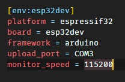

  4. Se utilizaron las bibliotecas adecuadas, incluyendo la API de Arduino para ESP32, que permite modificar la frecuencia del procesador y realizar mediciones de tiempo. Se emplearon funciones como setCpuFrequencyMhz() para ajustar la frecuencia y millis() para registrar los tiempos de ejecución de las operaciones.

### **🔹 4.2 Carga y Ejecución del Código**

Se realizaron pruebas con frecuencias de 80 MHz y 160 MHz, midiendo el rendimiento de operaciones matemáticas con enteros y flotantes. Los resultados obtenidos fueron:

    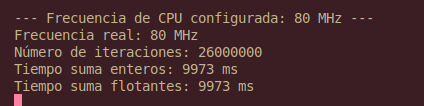

    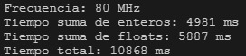

### **🔹 4.3 Tabla de Resultados**

| Frecuencia (MHz) | Iteraciones | Tiempo suma enteros (ms) | Tiempo suma flotantes (ms) | Tiempo total (ms) | Rendimiento (1/s) |
|------------------|-------------|--------------------------|----------------------------|-------------------|-------------------|
| 80 MHz           | 35.000.000  | 4981                     | 5887                       | 10868             | 0.000092          |
| 160 MHz          | 35.000.000  | 2447                     | 2892                       | 5339              | 0.000187          |

### **🔹 4.4 Cálculo de SpeedUp**
1. Cálculo del rendimiento (1/s)

    Primero, calculamos el rendimiento para cada frecuencia usando la fórmula: ηprog = 1 / Tprog

    - Para **80 MHz**:
      
      ηprog = 1 / 10868 ms ≈ 0.000092 s⁻¹

    - Para **160 MHz**:

      ηprog = 1 / 5339 ms ≈ 0.000187 s⁻¹
2. Cálculo del Speedup

    El **speedup** se calcula ahora como la relación entre el rendimiento en la frecuencia más alta (160 MHz) y el rendimiento en la frecuencia más baja (80 MHz).

      $Speedup = \frac{ηprog_{160}}{ηprog_{80}} = \frac{0.000187}{0.000092} \approx 2.03$

Este valor indica que, al duplicar la frecuencia de la CPU de **80 MHz** a **160 MHz**, el rendimiento mejora aproximadamente **2.03 veces**. Es decir, el sistema es **más de dos veces más rápido** a 160 MHz en comparación con 80 MHz.

### **🔹 4.5 Conclusiones Finales**

El **speedup** de **2.03** es bastante cercano a la duplicación esperada del rendimiento debido al aumento de la frecuencia de la CPU. Esto sugiere que, para esta tarea específica (sumas de enteros y flotantes), el rendimiento sigue una relación casi lineal con la frecuencia de la CPU. Sin embargo, este comportamiento puede variar dependiendo de la naturaleza de las tareas, ya que en algunas situaciones el rendimiento puede no escalar de manera tan lineal debido a otros factores como la latencia de memoria, la arquitectura del procesador y las optimizaciones del compilador.

## **5️⃣ Ejercicio 4: Profiling y análisis de rendimiento del código**

Se siguieron la serie de instrucciones para medir los tiempos de ejecucion de las distintas funciones proporcionadas y se determinó qué partes del código consumen más recursos computacionales.

Se adjuntan las capturas realizadas de uno de los participantes del equipo que tiene las siguientes especificaciones: 

*Intel(R) Core(TM) i7-7500U CPU @ 2.70GHz 2.90 GHz - SSD 256GB   - RAM 8GB*

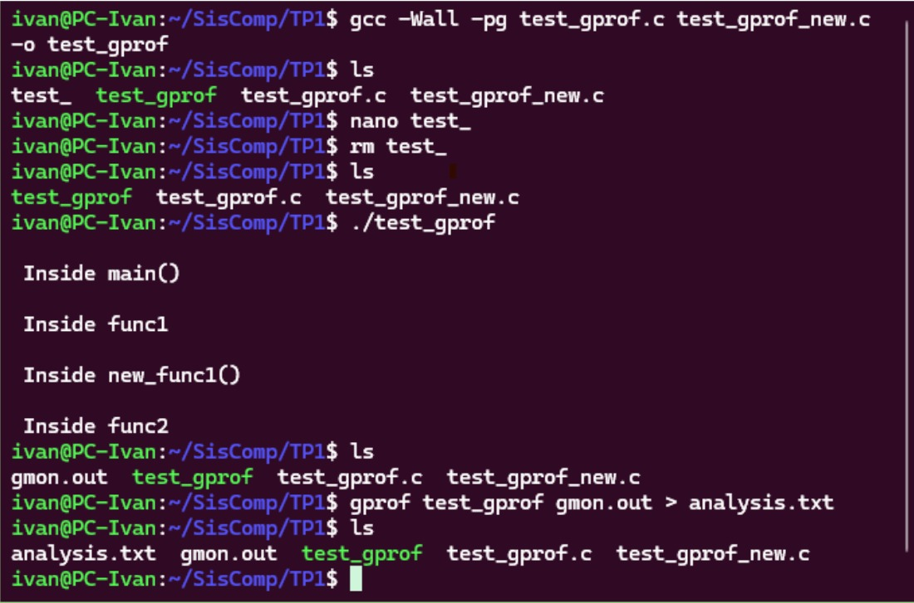

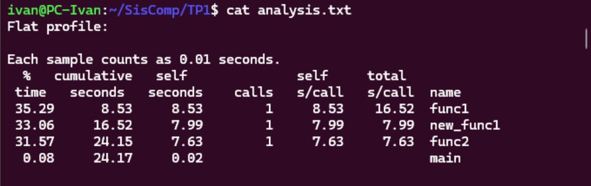

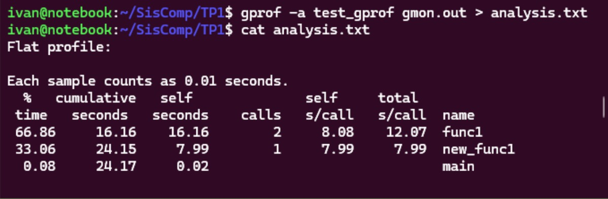

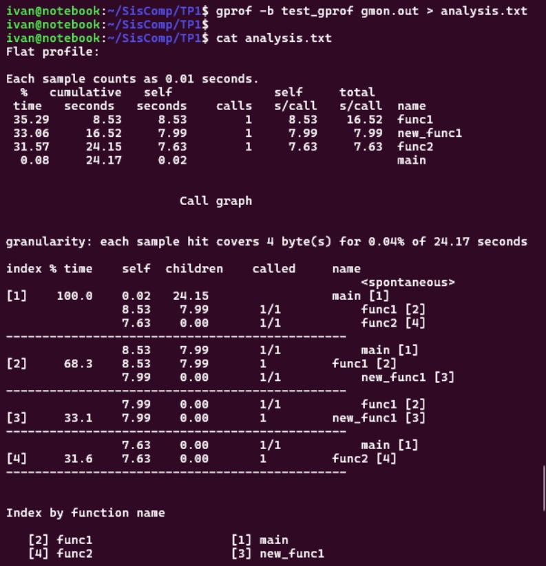

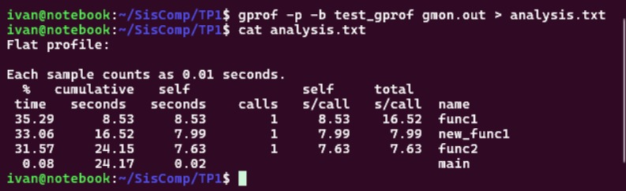

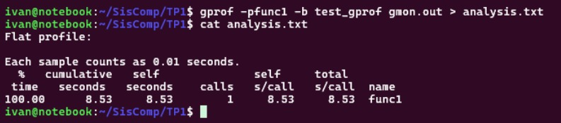

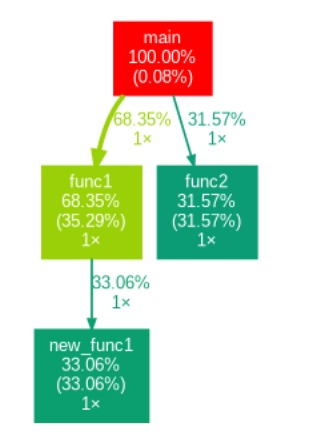

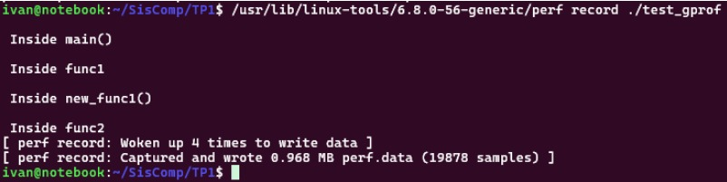

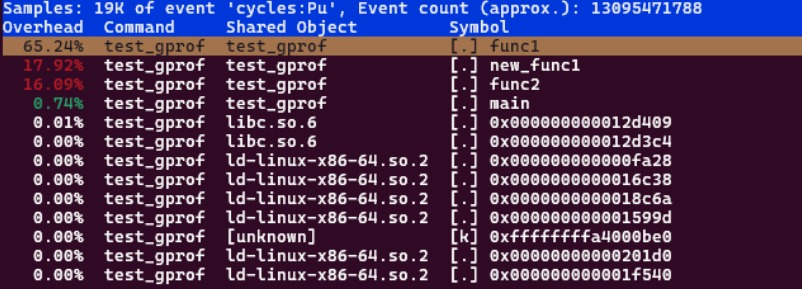

### **🔹Tabla de resultados**
Si comparamos el rendimiento de todo el equipo:

*Intel(R) Core(TM) i3-7020U CPU @ 2.30GHz - SSD 240GB - RAM 6GB*

*Intel(R) Core(TM) i5-7300U CPU @ 2.60GHz - SSD 256GB - RAM 8GB*

*Intel(R) Core(TM) i7-7500U CPU @ 2.70GHz 2.90 GHz - SSD 256GB   - RAM 8GB*

| CPU | Almacenamiento | RAM | Tiempo Total (s) | Tiempo en `main` (s) | Tiempo en `func1` (s) | Tiempo en `func2` (s) | Tiempo en `newfunc` (s) | GCC Version |
|------------------------------|-------------|-----|---------------|----------------|----------------|----------------|----------------|----------------|
| **Intel Core i3-7020U @ 2.30GHz** | SSD 240GB  | 6GB | 31.89 | 0.06 | 10.80 | 9.95 | 11.08 |  13.3.0 |
| **Intel Core i5-7300U @ 2.60GHz** | SSD 256GB  | 8GB | 20.99 | 0.05 | 7.18  | 6.56 | 7.20  |  13.3.0 |
| **Intel Core i7-7500U @ 2.70GHz** | SSD 256GB  | 8GB | 24.17 | 0.02 | 8.53  | 7.73 | 7.99  |  13.3.0 |

El análisis de Time Profiling muestra diferencias en el tiempo de ejecución del programa según la configuración del hardware. En general, el procesador Intel Core i5-7300U presentó el mejor desempeño con un tiempo total de 20.99s, mientras que el Intel Core i3-7020U tuvo el peor rendimiento con 31.89s, lo cual era esperado debido a sus especificaciones más bajas.

A pesar de que el Intel Core i7-7500U es teóricamente más potente, su tiempo total de 24.17s no refleja una ventaja significativa sobre el i5. Posiblemente debido a la falta de una instalación nativa de Linux.

----
