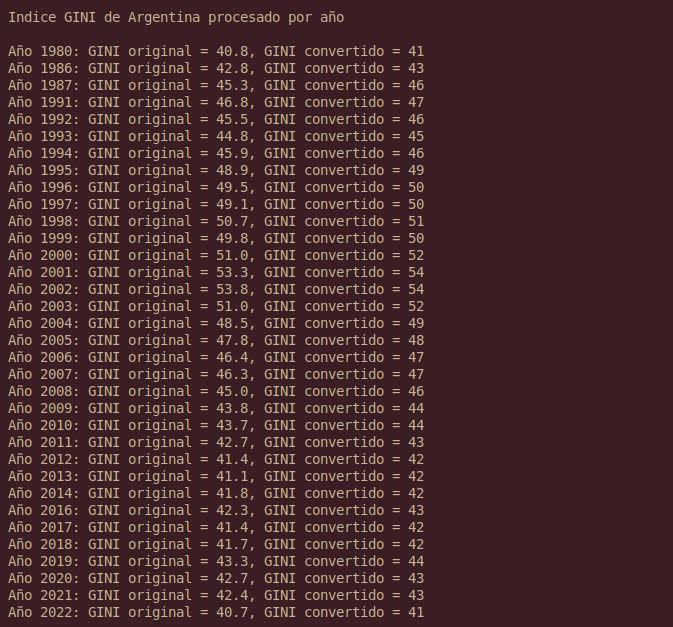

# TP02 – Sistemas de Computación  

```
    TP02/
    ├─ src/
    │  ├─ api_rest.py       # Script Python para consumir API y preparar datos
    │  └─ main.c            # Biblioteca en C que implementa la función convert()
    └─ scripts/
    └─ build_and_run.sh  # Script de automatización: venv, dependencias, compilación y ejecución
```

## Primera Iteración – API REST, Python y C

### 🔹 Objetivo

En esta primera etapa del Trabajo Práctico #2 se busca:

- Obtener datos reales del índice GINI de Argentina desde la API REST del Banco Mundial.
- Filtrar y ordenar los datos en Python.
- Exportar una función en C para procesar esos datos (convertir de float a int y sumar 1).
- Integrar Python y C mediante ctypes.

---

### 🐍 Script en Python (api_rest.py)

Se desarrolló un script en Python (`api_rest.py`) que:

- Consulta la API REST del Banco Mundial.
- Extrae los valores del índice GINI para Argentina.
- Filtra los datos no nulos.
- Los guarda en la lista `data` con el formato `año,valor`.
- Copia los valores GINI a un arreglo `input_array`, que luego se pasará como argumento para el programa en C.
- Luego de que se procesan los datos, los imprime.

#### Ejemplo de datos obtenidos:

        1980,40.8
        1986,42.8
        1987,45.3
        ...


---

### ⚙️ Procesamiento en C

El archivo `main.c` lee línea por línea el archivo `gini_data.txt`. Por cada entrada:

- Se recorre el array y se convierte cada valor de `float` a `int`.
- Se le suma 1 (uno) al valor convertido.
- Los resultados se guardan en el array `output`.

#### Fragmento de código:


```c
void convert(float* input, int* output, int size) {
 
    for(int i = 0; i < size; i++){
        output[i] = (int) input[i];
        output[i] += 1;
    }

}
```


#### Ejemplo de salida por consola:

<div style="text-align: center;">
    
</div>

## Segunda Iteración – Python, C, Assembler x64 y GDB

### 🔹 Objetivo

En esta segunda etapa, se busca expandir el trabajo realizado en la primera iteración mediante la implementación de los siguientes items:
- Añadir un programa en Assembler que realice la tarea de conversión a entero y sumar uno (en lugar de realizarse en C).
- Utilizar la herramienta `gdb` para realizar un debug del código en Assembler.
- Mediante la misma, observar direcciones, valores que almacenan y visualizar el estado del st

---

### 🐍 Script en Python

El script en Python (`api_rest.py`) permanece sin cambios, es decir que sigue realizando las siguientes tareas:
- Consulta la API REST del Banco Mundial.
- Extrae los valores del índice GINI para Argentina.
- Filtra los datos no nulos.
- Los guarda en la lista `data` con el formato `año,valor`.
- Copia los valores GINI a un arreglo `input_array`, que luego se pasará como argumento para el programa en C.
- Luego de que se procesan los datos, los imprime.

---

### ⚙️ Capa intermedia en C

- El archivo `main.c` lee uno por uno cada elemento del arreglo y se lo pasa a una función en Assembler para realizar la conversión.
- Cada valor convertido se guarda en un arreglo de salida, que luego serán presentados en el script de Python.

#### Fragmento del programa:
```c
//Declaracion externa de funcion ASM
extern int convertir_float_a_int(float value);  //funcion en ASM

void convert(float* input, int* output, int size){
    for(int i = 0; i < size; i++){
        output[i] = convertir_float_a_int(input[i]);
    }
}
```

---

### 🧱 Procesamiento en Assembler x64

Se utilizó Assembler de 64 bits para _matchear_ las arquitecturas con respecto al script de Python.

- El programa recibe un valor en cada llamado, desde la función en C, al registro `xmm0`.
- Lo trunca a entero y lo mueve a `EAX`. 
- Le suma 1 (uno) al registro mencionado.
- Restablece el stack.
- Retorna al programa en C.

#### Fragmento del programa:
```asm
convertir_float_a_int:
    ; 64-bit Linux calling convention:
    ; - float arg is in xmm0
    ; - Return value: int in eax

    sub rsp, 8             ; Reservar espacio stack

    cvttss2si eax, xmm0    ; Convertir float a int
    add eax, 1             ; Agregar 1 al resultado

    add rsp, 8
    ret
```

---

### 🐛 GNU Debugger

La última sección del trabajo implica adquirir conocimientos acerca de los comandos básicos de GDB y sus respectivas utilizaciones, con el fin de realizar el debug de programas. 