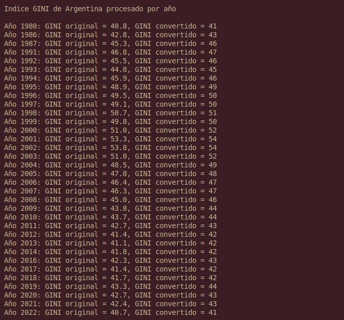
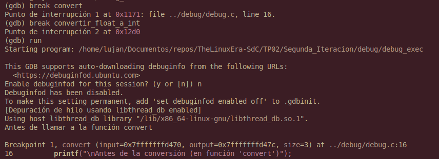
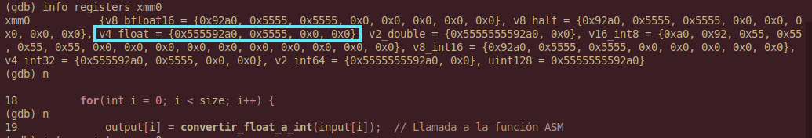
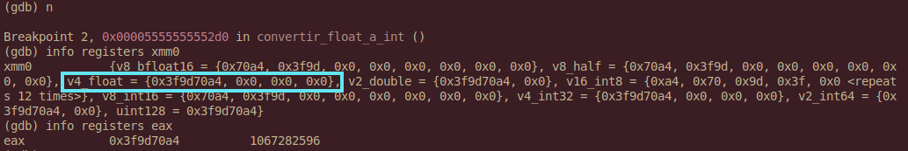
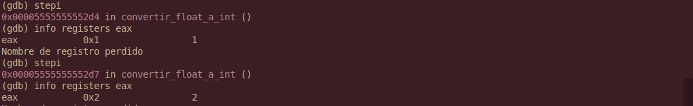

# TP02 – Sistemas de Computación  

## Primera Iteración – API REST, Python y C

#### 🔹 Objetivo

En esta primera etapa del Trabajo Práctico #2 se busca:

- Obtener datos reales del índice GINI de Argentina desde la API REST del Banco Mundial.
- Filtrar y ordenar los datos en Python.
- Exportar una función en C para procesar esos datos (convertir de float a int y sumar 1).
- Integrar Python y C mediante `ctypes`.

---

#### 🐍 Script en Python (api_rest.py)

El script de python realiza lo siguiente:

##### 1- Consulta HTTP a la API del Banco Mundial

```python

url = "http://api.worldbank.org/v2/country/AR/indicator/SI.POV.GINI?format=json&per_page=100"

response = requests.get(url)
```

##### 2- Parseo y filtrado del JSON

```python
data = response.json()
gini_values = []

for entry in data[1]:
    year = entry['date']
    value = entry['value']
    if value is not None:
        gini_values.append((int(year), float(value)))

gini_values.sort()
```

##### 3- Preparación de arrays C usando ctypes

```python
# Guardar años y valores en arrays
float_values = [value for (year, value) in gini_values]
int_year = [year for (year, value) in gini_values]

length = len(float_values)
input_array = (ctypes.c_float * length)(*float_values)
output_array = (ctypes.c_int * length)()
```

##### 4- Invocación de la función C

```python
# Cargar la libreria
lib_path = os.path.join(os.path.dirname(__file__), '../scripts/main.so')
lib = ctypes.CDLL(lib_path)

# Definir argumentos
lib.convert.argtypes = (ctypes.POINTER(ctypes.c_float), ctypes.POINTER(ctypes.c_int), ctypes.c_int)

# Definir tipo return
lib.convert.restype = ctypes.c_void_p

# Wrapper
def convert(input, output, length):
    lib.convert(input, output, length)
```

##### 5- Impresión de resultados

```python
result = np.ctypeslib.as_array(output_array)

print("\nIndice GINI de Argentina procesado por año\n") 

for i in range(length):
    print(f"Año {int_year[i]}: GINI original = {float_values[i]}, GINI convertido = {result[i]}")
```

---

#### ⚙️ Procesamiento en C

Se implementó la función convert, compilada como biblioteca compartida (main.so):

```c
void convert(float* input, int* output, int size){
    for(int i = 0; i < size; i++){
        output[i] = (int) input[i];
        output[i] += 1;
    }
}
```

Convierte cada float a int truncando y luego sumando 1.

---

#### 🔧 Script de automatización (build_and_run.sh)

El script monta todo el flujo en un entorno virtual y compila la biblioteca:

```bash
#!/bin/bash

# Activar entorno virtual
echo "Activando entorno virtual..."
if [ ! -d "venv" ]; then
    echo "El entorno virtual no existe. Creando uno nuevo..."
    python3 -m venv venv || { echo "Error al crear el entorno virtual."; exit 1; }
fi

source venv/bin/activate || { echo "No se pudo activar el entorno virtual."; exit 1; }

# Verificar e instalar numpy
echo "Verificando e instalando numpy..."
pip install numpy
# Verificar e instalar requests
echo "Verificando e instalando requests..."
pip install requests 

# Compilar archivos C
echo "Compilando archivos C.."
gcc -c -o main.o ../src/main.c

# Crear librería compartida
echo "Creando librería compartida..."
gcc -shared -o main.so main.o

# Ejecutar el script de Python
echo "Ejecutando script de Python..."
python3 ../src/api_rest.py

```

#### Salida por consola


## Segunda Iteración – Python, C, Assembler x64 y GDB

#### 🔹 Objetivo

En esta segunda etapa, se busca expandir el trabajo realizado en la primera iteración mediante la implementación de los siguientes items:

- Añadir un programa en Assembler que realice la tarea de conversión a entero y sumar uno (en lugar de realizarse en C).
- Utilizar la herramienta `gdb` para realizar un debug del código en Assembler.
- Mediante la misma, observar direcciones, valores que almacenan y visualizar el estado del stack.

---

#### 🐍 Script en Python

El script en Python (`api_rest.py`) permanece sin cambios, es decir que sigue realizando las siguientes tareas:

- Consulta la API REST del Banco Mundial.
- Extrae los valores del índice GINI para Argentina.
- Filtra los datos no nulos.
- Los guarda en la lista `data` con el formato `año,valor`.
- Copia los valores GINI a un arreglo `input_array`, que luego se pasará como argumento para el programa en C.
- Luego de que se procesan los datos, los imprime.

---

#### ⚙️ Capa intermedia en C

- El archivo `main.c` lee uno por uno cada elemento del arreglo y se lo pasa a una función en Assembler para realizar la conversión.
- Cada valor convertido se guarda en un arreglo de salida, que luego serán presentados en el script de Python.

##### Fragmento del programa:
```c
//Declaracion externa de funcion ASM
extern int convertir_float_a_int(float value);  //funcion en ASM

void convert(float* input, int* output, int size){
    for(int i = 0; i < size; i++){
        output[i] = convertir_float_a_int(input[i]);
    }
}
```

---

#### 🧱 Procesamiento en Assembler x64

Se utilizó Assembler de 64 bits para _matchear_ las arquitecturas con respecto al script de Python.

- El programa recibe un valor en cada llamado, desde la función en C, al registro `xmm0`.
- Lo trunca a entero y lo mueve a `EAX`. 
- Le suma 1 (uno) al registro mencionado.
- Retorna al programa en C.

__Fragmento del programa:__

```asm
convertir_float_a_int:
    ; Convención de llamadas de Linux en 64 bits:
    ; - El argumento de tipo float se pasa en xmm0
    ; - El valor de retorno de tipo int se devuelve en eax

    cvttss2si eax, xmm0    ; Convertir el valor float en xmm0 a int en eax (trunca)
    add eax, 1             ; Agregar 1 al resultado

    ret
```

#### Salida por consola



---

### 🐛 GNU Debugger

La última parte del trabajo consistió en utilizar GDB (GNU Debugger) para inspeccionar el comportamiento del programa en tiempo de ejecución, especialmente en lo referente a la llamada desde C a una función implementada en Assembler.

#### 🔍 Objetivo

El objetivo fue entender cómo se realiza el paso de parámetros entre C y Assembler en arquitectura x86_64, y visualizar el contenido de los registros utilizados, ya que en este caso los argumentos no se pasan por la pila, sino a través de registros.

#### 🧠 Observaciones

- El parámetro float que se pasa desde C a la función `convertir_float_a_int` en ASM se coloca automáticamente en el registro `xmm0`.
- El valor de retorno de tipo int se guarda en el registro `eax`.
- Por este motivo, la pila no contiene los argumentos, y se deben inspeccionar directamente estos registros.

#### 🛠️ Proceso

Para facilitar la depuración:

- Se compiló el código C con la opción -g para incluir símbolos de depuración.
- Se escribió un script bash que compila tanto el archivo en ASM como el de C, y luego los enlaza en un único ejecutable (debug_exec).
- Se utilizó GDB para colocar breakpoints dentro de la función convert, justo antes de la llamada a la función en ASM, y se inspeccionaron los registros `xmm0` y `eax` usando comandos como:

```gdb
info registers xmm0
info registers eax
```

#### 📸 Capturas

A continuación se incluyen capturas del estado de los registros antes y después de ejecutar la función ASM, verificando la correcta recepción del valor en `xmm0` y el resultado almacenado en `eax`.

##### Captura 1 – Inicializando la sesión de depuración

Se colocan breakpoints en las funciones `convert` y `convertir_float_a_int`. Luego con el comando `run` se ejecuta el programa `debug.c`



##### Captura 2 – Antes de ingresar a la función en ASM

Inspeccionamos el contenido del registro `xmm0` con el comando `info registers xmm0` antes de entrar a la función `convertir_float_a_int`. En la salida de GDB, el registro se muestra con múltiples interpretaciones. El valor del parámetro float pasado desde C se puede encontrar en el primer elemento del campo `v4_float`, ya que este representa una vista de `xmm0` como un vector de cuatro valores de 32 bits (precisión simple), que es el formato estándar para los float en C. En este punto, el registro no ha sido inicializado por el compilador con el valor correspondiente, por lo que muestra datos basura o residuales. Esta captura sirve para evidenciar que el valor aún no fue pasado a la función.



##### Captura 3 – Dentro de la función en ASM

Ahora el campo `v4_float` muestra como primer valor de 32 bits a `0x3f9d70a4` el cual representa el número en coma flotante pasado desde C. Dicho valor corresponde aproximadamente a 1.23.

El registro `eax` ya poseía un valor numérico que podría llevar a la confusión de que ese valor proviene del argumento. Esto no es correcto ya que `eax` aún no ha sido modificado por la función y contiene un valor residual de ejecuciones anteriores. Es decir, en este punto `eax` no tiene relación con `xmm0`.



##### Captura 4 – Dentro de la función en ASM

Para confirmar el momento exacto en el que se produce la conversión, se avanzó una instrucción con:

```gdb
(gdb) stepi
```

Luego de ejecutar la instrucción:

```asm
cvttss2si eax, xmm0
```

El registro `eax` pasó a contener el valor entero truncado correspondiente al número flotante en `xmm0`.

Se avanza una instrucción más, ahora se ejecuta:

```asm
add eax, 1
```

Lo que provocó que el valor de `eax` se incrementara en 1. Es decir, el número final retornado por la función fue 2.


