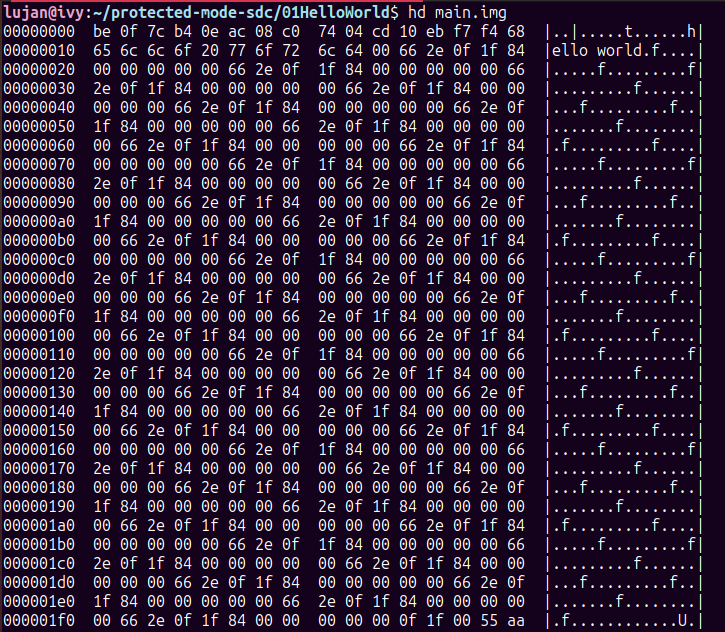
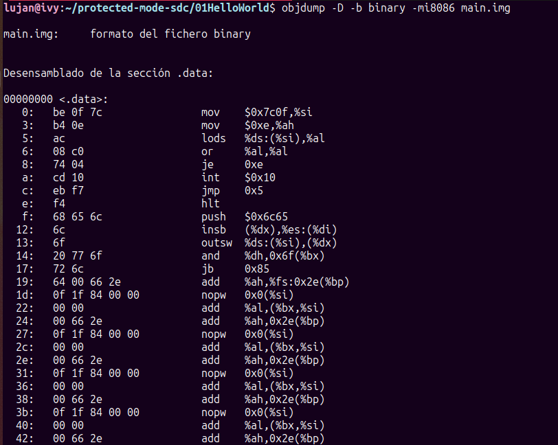
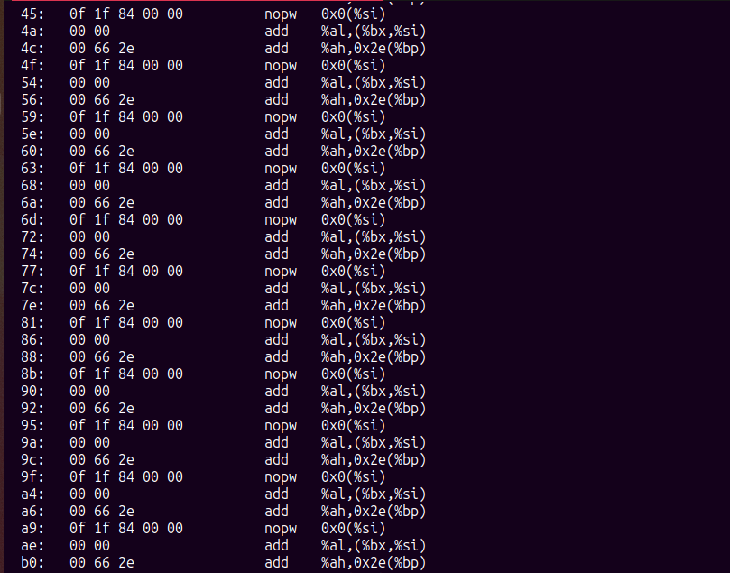
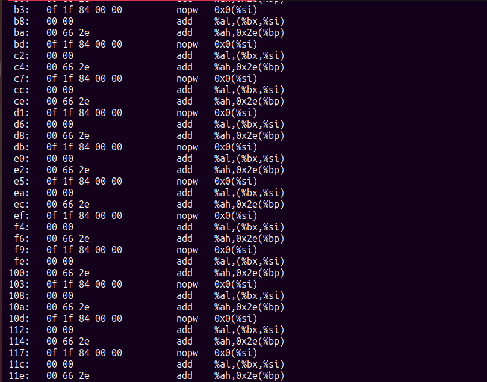
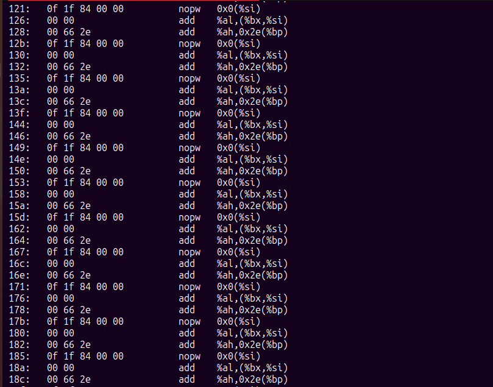
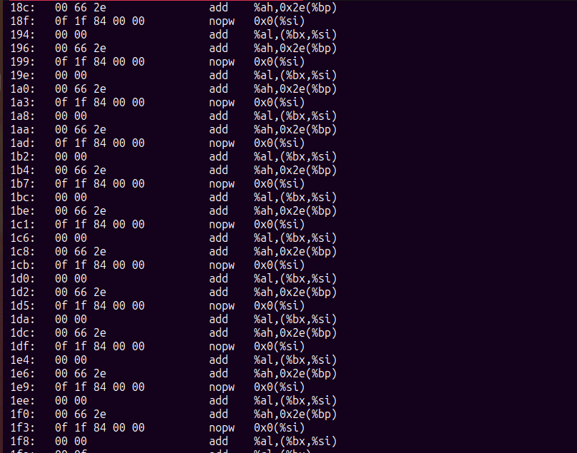
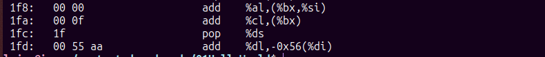
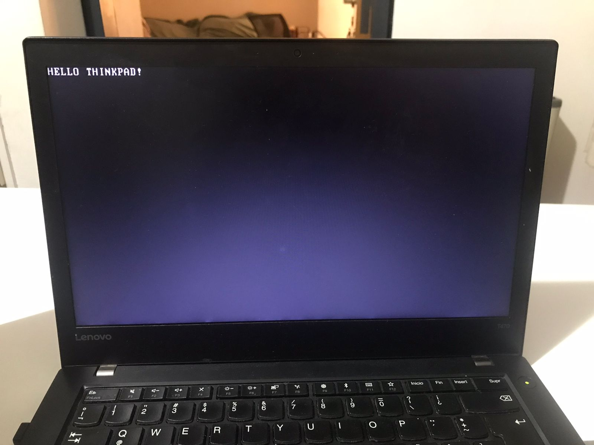
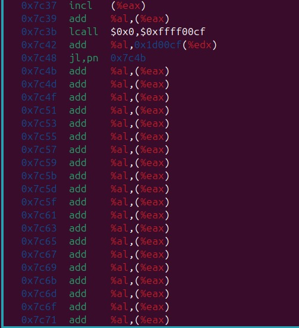
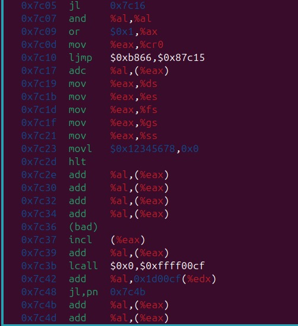

# TP03: Modo Real vs. Modo Protegido

## 🎯 Objetivos

- Comprender la diferencia entre el modo real y el modo protegido de operación del procesador.

- Identificar cómo se forman y traducen las direcciones lógicas y físicas en ambos modos.

- Aplicar los conceptos vistos en clase para interpretar estructuras como GDT, descriptores de segmento y direcciones físicas en modo protegido.

- Afianzar el conocimiento sobre la arquitectura x86 y el manejo de la memoria según el modo de operación del procesador.

## 🔶 Desafíos

### ⚙️ UEFI y Coreboot

#### **1.1- ¿Qué es UEFI? ¿Cómo puedo usarlo? Mencionar además una función a la que podría llamar usando esa dinámica.**

UEFI (Unified Extensible Firmware Interface) es una interfaz de firmware moderna que reemplaza al BIOS tradicional. Su objetivo es inicializar el hardware y cargar el sistema operativo, pero con una arquitectura más flexible, modular y segura que BIOS.

*Podés usar UEFI para:*

- Configurar hardware antes de que se inicie el SO.

- Cargar un cargador de arranque (como GRUB).

- Acceder a servicios como manejo de memoria, dispositivos, variables persistentes, etc.

Una función típica que podrías llamar usando la API de UEFI es GetMemoryMap, que permite obtener el mapa de memoria actual para que el sistema operativo sepa qué áreas puede usar.

#### **1.2- Menciona casos de bugs de UEFI que puedan ser explotados**

Algunos ejemplos: 

- **LoJax (2018):** un rootkit persistente que infectaba el firmware UEFI, usando una vulnerabilidad para escribir en la SPI Flash y resistir reinstalaciones del sistema operativo.

- **Plundervolt (2019):** aunque más relacionada con voltajes, mostraba cómo firmware mal configurado permitía acceso a configuraciones críticas del procesador.

- **BIOS ThunderSpy:** aprovechaba accesos físicos al puerto Thunderbolt para modificar el firmware UEFI y omitir autenticación.

Estos bugs son críticos porque se ejecutan a bajo nivel, antes que cualquier antivirus, y pueden persistir incluso al formatear el disco.

#### **1.3- ¿Qué es Converged Security and Management Engine (CSME), the Intel Management Engine BIOS Extension (Intel MEBx)?**

- **CSME (Converged Security and Management Engine)** es un subsistema dentro del chipset Intel que ofrece funciones de seguridad (como TPM, verificación de arranque) y administración remota. Forma parte de Intel ME (Management Engine).

- **Intel MEBx** es una extensión de BIOS que permite configurar funcionalidades del Intel ME, como AMT (tecnología de administración activa). Se accede normalmente al encender la computadora.

Son tecnologías potentes pero también polémicas, ya que operan en un entorno separado del sistema operativo, con acceso privilegiado al hardware.

#### **1.4- ¿Qué es coreboot? ¿Qué productos lo incorporan? ¿Cuáles son las ventajas de su utilización?**

**coreboot** es un firmware de código abierto que reemplaza al BIOS propietario. Su objetivo es realizar la inicialización mínima del hardware y luego pasar el control a un cargador de sistema operativo o payload como SeaBIOS o GRUB.

**Productos que lo usan:**

- Algunas Chromebooks.

- Computadoras de Purism (Librem).

- Placas madre de fabricantes como ASUS o Gigabyte (con modificaciones).

- Proyectos como Libreboot (basado en coreboot).

**Ventajas:**

- Código abierto: auditable y modificable.

- Más rápido en el arranque.

- Más seguro: sin binarios propietarios ocultos.

- Flexible: podés adaptar el firmware a tus necesidades específicas.

---

### 🔗 Linker

#### **2.1 ¿Qué es un linker? ¿Qué hace?**

Un linker es una herramienta que toma uno o más archivos objeto generados por el compilador (por ejemplo .o) y los une en un archivo ejecutable final (como .elf, .bin o .exe).

Sus funciones principales son:

- Resolver referencias cruzadas entre funciones y variables definidas en distintos archivos.

- Asignar direcciones de memoria a cada segmento del programa.

- Generar el formato binario final (ejemplo: ELF o binario plano) que puede ejecutarse o grabarse en una memoria.


#### **2.2 ¿Qué es la dirección que aparece en el script del linker? ¿Por qué es necesaria?**

En un script de linker (archivo .ld), se especifica una dirección base de carga del programa, como por ejemplo:

```ld
SECTIONS {
  . = 0x7C00;
  .text : { *(.text) }
}
```

Esta dirección (en el ejemplo 0x7C00) indica dónde en la memoria se cargará el programa cuando se ejecute. Es necesaria porque:

- Permite al linker calcular correctamente las direcciones absolutas.

- Asegura que el programa funcione correctamente al acceder a variables o saltar a funciones (porque las direcciones deben coincidir con la ubicación real en RAM).

- Es crítica en entornos de bajo nivel, como el arranque (boot), donde el BIOS carga el programa en una posición fija (ej.: 0x7C00 para bootloaders).

#### **2.3 Compare la salida de objdump con hd, verifique dónde fue colocado el programa dentro de la imagen.**

- Salida de comando `hd main.img`



- Salida de comando `objdump -D -b binary -mi8086 main.img`








- La salida de `hd main.img` muestra el contenido raw del archivo binario byte a byte, indicando el offset  desde el inicio del archivo para cada línea. Se observó que la secuencia de bytes correspondiente al código ejecutable del programa comienza en el offset 00000000 (el inicio del archivo), seguida por la secuencia de bytes de la cadena "hello world" terminada en nulo. La firma de arranque 0xAA55 (mostrada como 55 aa en little-endian) se encontró en el offset 000001f0.

- La salida de `objdump -D -b binary -mi8086 main.img` desensambló el archivo binario interpretándolo como código de 16 bits (modo 8086). Este desensamblado confirmó que la secuencia de bytes que inicia en el offset 00000000 corresponde efectivamente a las instrucciones del código fuente de main.S. El desensamblado posterior a la sección de código válido mostró interpretaciones incorrectas de los datos (la cadena y el relleno) como instrucciones, lo cual es esperado al desensamblar un binario raw.

La comparación confirma que el linker construyó el archivo main.img colocando el código ejecutable y los datos (la cadena "hello world") al inicio del archivo binario (offset 00000000). Esta posición se corresponde con la dirección de memoria 0x7c00 especificada en el script del linker para la carga del sector de arranque por la BIOS. La firma de arranque 0xAA55 fue colocada correctamente en el offset 000001f0, asegurando que se sitúe al final del primer sector de 512 bytes, como lo requiere el formato de un sector de arranque válido. El espacio intermedio entre el final del programa y la firma fue llenado con padding.

#### **2.4 Grabar la imagen en un pendrive, probarla en una PC y subir una foto.**

Para probar el bootloader en una máquina real, se compiló el código ensamblador (boot.asm) con NASM y se generó una imagen binaria (boot.img). Luego, se grabó la imagen en un pendrive usando el siguiente comando:

```bash
sudo dd if=boot.img of=/dev/sdX bs=512 count=1

```

Reemplazar /dev/sdX por la ruta correcta del dispositivo USB. 

Finalmente, se conectó el pendrive a una notebook ThinkPad, se configuró la BIOS para arrancar desde el USB, y al iniciar, la pantalla mostró correctamente el mensaje "HELLO THINKPAD!", demostrando que el código se ejecutó directamente desde el sector de arranque.



#### **2.5 ¿Para qué se utiliza la opción --oformat binary  en el linker?**

La opción ``--oformat binary`` en el linker (en este caso, ld) se utiliza para indicar que el archivo de salida debe ser un archivo binario sin ningún tipo de cabecera o metadatos adicionales que suelen incluirse en los archivos objeto o ejecutables.

---

### 🔒 Modo Protegido

#### **3.1 Crear un código assembler que pueda pasar a modo protegido (sin macros).**
```
[bits 16]        ; Modo real
org 0x7C00

start:
    cli                     ; Desactivar interrupciones (por seguridad antes del cambio de modo)

    lgdt [gdt_descriptor]   ; Cargar la GDT y tamaño de la GDT (estructura con segmentos)

    mov eax, cr0
    or eax, 0x1             ; Setear bit PE (Protection Enable) del registro de control CR0
    mov cr0, eax
; A partir de ahora esta en modo protegido por lo que no es valido ejecutar codigo de 16 bits 
   
    jmp 0x08:protected_mode ; Salto lejano: cambia CS con un valor valido del nuevo entorno protegido

; -------- Código en modo protegido ----------
[bits 32]
protected_mode:
    ; Ya estamos en modo protegido
    mov ax, 0x10           ; Data segment selector, para que se haga en modo protegido
    mov ds, ax
    mov es, ax
    mov fs, ax
    mov gs, ax
    mov ss, ax

    hlt                    ; Halt -> detiene la CPU

; -------- GDT ----------
gdt_start:
    dq 0x0000000000000000     ; Descriptor nulo
    dq 0x00CF9A000000FFFF     ; Code segment (base=0, limit=4GB, exec)
    dq 0x00CF92000000FFFF     ; Data segment (base=0, limit=4GB, read/write)

gdt_descriptor:
    dw gdt_end - gdt_start - 1
    dd gdt_start

gdt_end:

times 510 - ($ - $$) db 0 ; Rellena con ceros hasta los 510 bytes.
dw 0xAA55                  ; Boot signature


```

#### **3.2 ¿Cómo sería un programa que tenga dos descriptores de memoria diferentes, uno para cada segmento (código y datos) en espacios de memoria diferenciados?**

En la **GDT** (Global Descriptor Table), podemos definir 3 descriptores:

1.  dq 0x0000000000000000     ; descriptor nulo, es obligatorio.
2.  dq 0x00CF9A000000FFFF     ; descriptor de código en 0x00000000, tiene permisos de ejecucion y lectura (0x9A)
3.  dq 0x00CF92001000FFFF     ; descriptor de datos en 0x00100000, permisos de lectura y escritura(0x92) o solo lectura (0x90)

Esto crea:
- Código en dirección base 0x00000000

- Datos en dirección base 0x00100000

En modo protegido, los registros de segmento (CS, DS, etc.) usan estos descriptores como base + offset, lo que permite separar físicamente ambos segmentos en RAM.

#### **3.3 Cambiar los bits de acceso del segmento de datos para que sea de solo lectura. Intentar escribir, ¿qué sucede?, ¿qué debería suceder a continuación? (revisar el teórico). Verificarlo con gdb.**

Cuando se configura el descriptor de segmento de datos con los bits de acceso marcando el segmento como solo lectura (por ejemplo, Access Byte = 0x90), el procesador:

1. Detecta una violación de protección si se intenta escribir en él.

2. Lanza una excepción de Protección General (#GP, interrupt 13).

3. Busca el manejador de la excepción en la IDT (Interrupt Descriptor Table).

4. Si la IDT no está cargada o no hay un handler definido para #GP, el procesador ejecuta código basura o salta a una dirección inválida, provocando un comportamiento indefinido, como:

     - Ejecución de instrucciones erráticas (por ejemplo: add %al, (%eax)).

     - Triple fault y reinicio automático del sistema (común en emuladores como QEMU).






#### **3.4 En modo protegido, ¿con qué valor se cargan los registros de segmento?, ¿por qué?**

Cuando un sistema pasa de modo real a modo protegido, los registros de segmento, como CS (Code Segment), DS (Data Segment), SS (Stack Segment), ES, FS, y GS, son cargados con valores que corresponden a selectores de segmentos válidos en la GDT (Global Descriptor Table).

Un selector de segmento en modo protegido no es una dirección física, sino un índice que apunta a una entrada dentro de la GDT o LDT. Los valores de los registros de segmento son selectores que apuntan a las descripciones de segmentos en la GDT, que contienen información como la base, el límite, los atributos de acceso y el estado del segmento.
