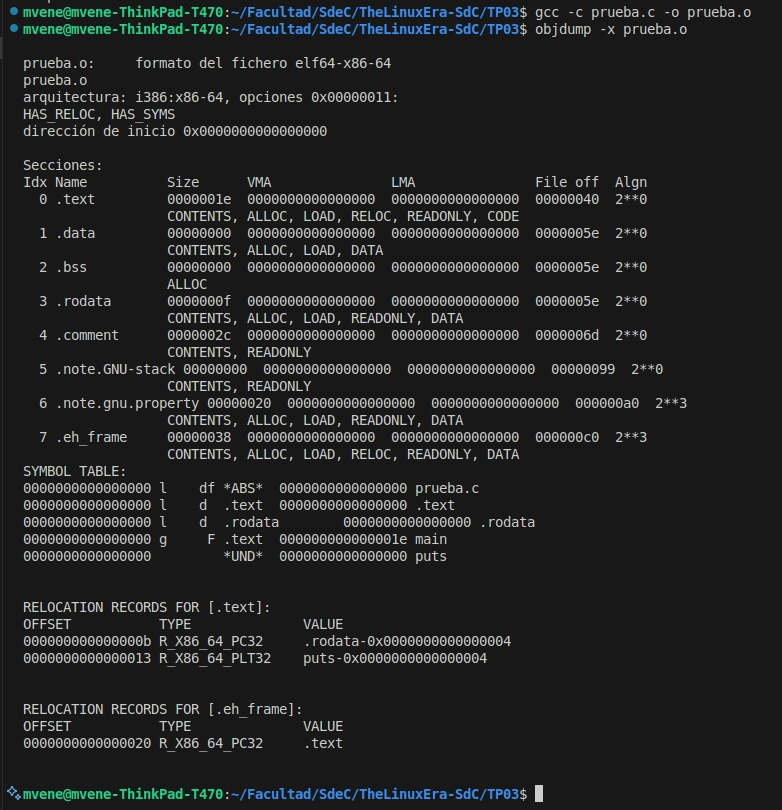
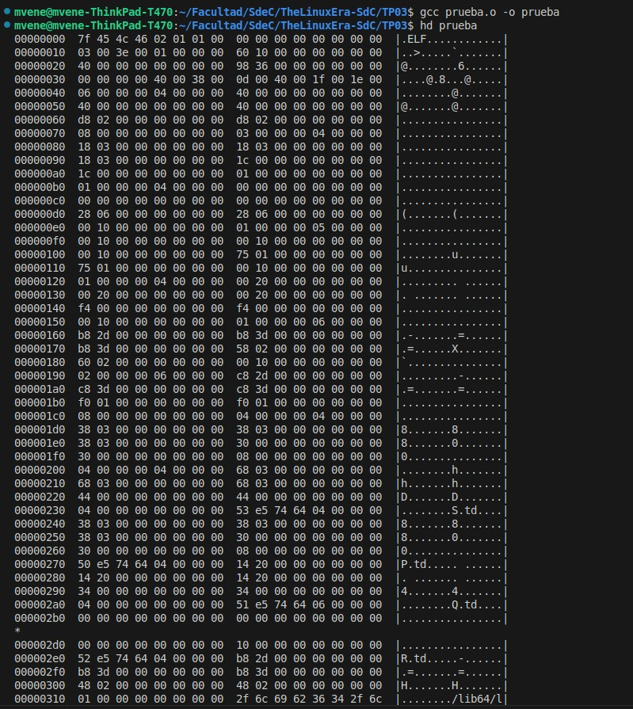

# TP03: Modo Real vs. Modo Protegido

## 🎯 Objetivos

- Comprender la diferencia entre el modo real y el modo protegido de operación del procesador.

- Identificar cómo se forman y traducen las direcciones lógicas y físicas en ambos modos.

- Analizar cómo se accede a la memoria utilizando segmentación en modo real y segmentación + paginación en modo protegido.

- Aplicar los conceptos vistos en clase para interpretar estructuras como GDT, descriptores de segmento y direcciones físicas en modo protegido.

- Afianzar el conocimiento sobre la arquitectura x86 y el manejo de la memoria según el modo de operación del procesador.

## 🔶 Desafíos

### ⚙️ UEFI y Coreboot

#### **¿Qué es UEFI? ¿Cómo puedo usarlo? Mencionar además una función a la que podría llamar usando esa dinámica.**

UEFI (Unified Extensible Firmware Interface) es una interfaz de firmware moderna que reemplaza al BIOS tradicional. Su objetivo es inicializar el hardware y cargar el sistema operativo, pero con una arquitectura más flexible, modular y segura que BIOS.

Podés usar UEFI para:

Configurar hardware antes de que se inicie el SO.

Cargar un cargador de arranque (como GRUB).

Acceder a servicios como manejo de memoria, dispositivos, variables persistentes, etc.

Una función típica que podrías llamar usando la API de UEFI es GetMemoryMap, que permite obtener el mapa de memoria actual para que el sistema operativo sepa qué áreas puede usar.

#### **¿Menciona casos de bugs de UEFI que puedan ser explotados?**
Algunos ejemplos: BUSCCAR QUE PINGO ES

- **LoJax (2018):** un rootkit persistente que infectaba el firmware UEFI, usando una vulnerabilidad para escribir en la SPI Flash y resistir reinstalaciones del sistema operativo.

- **Plundervolt (2019):** aunque más relacionada con voltajes, mostraba cómo firmware mal configurado permitía acceso a configuraciones críticas del procesador.

- **BIOS ThunderSpy:** aprovechaba accesos físicos al puerto Thunderbolt para modificar el firmware UEFI y omitir autenticación.

Estos bugs son críticos porque se ejecutan a bajo nivel, antes que cualquier antivirus, y pueden persistir incluso al formatear el disco.

#### **¿Qué es Converged Security and Management Engine (CSME), the Intel Management Engine BIOS Extension (Intel MEBx)?**

- **CSME (Converged Security and Management Engine)** es un subsistema dentro del chipset Intel que ofrece funciones de seguridad (como TPM, verificación de arranque) y administración remota. Forma parte de Intel ME (Management Engine).

- **Intel MEBx** es una extensión de BIOS que permite configurar funcionalidades del Intel ME, como AMT (tecnología de administración activa). Se accede normalmente al encender la máquina (por ejemplo, presionando Ctrl+P).

Son tecnologías potentes pero también polémicas, ya que operan en un entorno separado del sistema operativo, con acceso privilegiado al hardware.

#### ¿Qué es coreboot? ¿Qué productos lo incorporan? ¿Cuáles son las ventajas de su utilización?

**coreboot** es un firmware de código abierto que reemplaza al BIOS propietario. Su objetivo es realizar la inicialización mínima del hardware y luego pasar el control a un cargador de sistema operativo o payload como SeaBIOS o GRUB.

**Productos que lo usan:**

- Algunas Chromebooks.

- Computadoras de Purism (Librem).

- Placas madre de fabricantes como ASUS o Gigabyte (con modificaciones).

- Proyectos como Libreboot (basado en coreboot).

**Ventajas:**

- Código abierto: auditable y modificable.

- Más rápido en el arranque.

- Más seguro: sin binarios propietarios ocultos.

- Flexible: podés adaptar el firmware a tus necesidades específicas.

---

### 🔗 Linker

#### ¿Qué es un linker? ¿Qué hace? 

Un linker es una herramienta que toma uno o más archivos objeto generados por el compilador (por ejemplo .o) y los une en un archivo ejecutable final (como .elf, .bin o .exe).

Sus funciones principales son:

- Resolver referencias cruzadas entre funciones y variables definidas en distintos archivos.

- Asignar direcciones de memoria a cada segmento del programa.

- Generar el formato binario final (ej., ELF o binario plano) que puede ejecutarse o grabarse en una memoria.


#### ¿Qué es la dirección que aparece en el script del linker? ¿Por qué es necesaria?

En un script de linker (archivo .ld), se especifica una dirección base de carga del programa, como por ejemplo:

```
SECTIONS {
  . = 0x7C00;
  .text : { *(.text) }
}
```
Esta dirección (en el ejemplo 0x7C00) indica dónde en la memoria se cargará el programa cuando se ejecute. Es necesaria porque:

- Permite al linker calcular correctamente las direcciones absolutas.

- Asegura que el programa funcione correctamente al acceder a variables o saltar a funciones (porque las direcciones deben coincidir con la ubicación real en RAM).

- Es crítica en entornos de bajo nivel, como el arranque (boot), donde el BIOS carga el programa en una posición fija (ej.: 0x7C00 para bootloaders).

#### Compare la salida de ``objdump`` con ``hd``, verifique dónde fue colocado el programa dentro de la imagen. 

- **Direcciones en el archivo objeto (objdump):**

Las secciones del archivo objeto (como .text, .data, .rodata, etc.) están ubicadas en direcciones simbólicas dentro del archivo, todas con direcciones 0x0000000000000000. Esto es típico en los archivos objeto, ya que estas direcciones aún no han sido asignadas a direcciones físicas en la memoria.

- **Direcciones en el archivo ejecutable (hd):**

Al contrastar esto con la salida de hd del archivo ejecutable, vemos que las secciones del programa se han cargado en direcciones de memoria diferentes, que son las que se asignan al archivo ejecutable después de que el enlazador ha trabajado para colocar las secciones en su ubicación final en memoria.

*Ejemplos:*

La sección .text se coloca en la dirección 0x0000000000000060.

La sección .data comienza en 0x0000000000000098.

La sección .rodata comienza en 0x0000000000000180.

El enlazador asigna direcciones físicas a las secciones en la imagen del ejecutable, lo que hace que las direcciones en el archivo ejecutable sean diferentes a las direcciones en el archivo objeto. Las secciones del archivo objeto (como .text, .data y .rodata) tienen direcciones simbólicas (0x0000000000000000), pero una vez que el archivo objeto se enlaza, esas direcciones se resuelven y se colocan en direcciones específicas en la imagen ejecutable, como se puede observar en la salida de hd.

Entonces, el programa se coloca en la imagen del ejecutable en direcciones específicas que están asignadas después de la fase de enlazado.





#### Grabar la imagen en un pendrive, probarla en una PC y subir una foto.


#### ¿Para qué se utiliza la opción ``--oformat binary``  en el linker?

La opción ``--oformat binary`` en el linker (en este caso, ld) se utiliza para indicar que el archivo de salida debe ser un archivo binario sin ningún tipo de cabecera o metadatos adicionales que suelen incluirse en los archivos objeto o ejecutables.

---

### 🔒 Modo Protegido

#### Crear un código assembler que pueda pasar a modo protegido (sin macros).
```
[bits 16]        ; Modo real
org 0x7C00

start:
    cli                     ; Desactivar interrupciones (por seguridad antes del cambio de modo)

    lgdt [gdt_descriptor]   ; Cargar la GDT y tamaño de la GDT (estructura con segmentos)

    mov eax, cr0
    or eax, 0x1             ; Setear bit PE (Protection Enable) del registro de control CR0
    mov cr0, eax
; A partir de ahora esta en modo protegido por lo que no es valido ejecutar codigo de 16 bits 
   
    jmp 0x08:protected_mode ; Salto lejano: cambia CS con un valor valido del nuevo entorno protegido

; -------- Código en modo protegido ----------
[bits 32]
protected_mode:
    ; Ya estamos en modo protegido
    mov ax, 0x10           ; Data segment selector, para que se haga en modo protegido
    mov ds, ax
    mov es, ax
    mov fs, ax
    mov gs, ax
    mov ss, ax

    hlt                    ; Halt -> detiene la CPU

; -------- GDT ----------
gdt_start:
    dq 0x0000000000000000     ; Descriptor nulo
    dq 0x00CF9A000000FFFF     ; Code segment (base=0, limit=4GB, exec)
    dq 0x00CF92000000FFFF     ; Data segment (base=0, limit=4GB, read/write)

gdt_descriptor:
    dw gdt_end - gdt_start - 1
    dd gdt_start

gdt_end:

times 510 - ($ - $$) db 0 ; Rellena con ceros hasta los 510 bytes.
dw 0xAA55                  ; Boot signature


```

#### ¿Cómo sería un programa que tenga dos descriptores de memoria diferentes, uno para cada segmento (código y datos) en espacios de memoria diferenciados?

En la **GDT** (Global Descriptor Table), podemos definir 3 descriptores:

1.  dq 0x0000000000000000     ; descriptor nulo, es obligatorio.
2.  dq 0x00CF9A000000FFFF     ; descriptor de código en 0x00000000, tiene permisos de ejecucion y lectura (0x9A)
3.  dq 0x00CF92001000FFFF     ; descriptor de datos en 0x00100000, permisos de lectura y escritura(0x92) o solo lectura (0x90)

Esto crea:
- Código en dirección base 0x00000000

- Datos en dirección base 0x00100000

En modo protegido, los registros de segmento (CS, DS, etc.) usan estos descriptores como base + offset, lo que permite separar físicamente ambos segmentos en RAM.

#### Cambiar los bits de acceso del segmento de datos para que sea de solo lectura. Intentar escribir, ¿qué sucede?, ¿qué debería suceder a continuación? (revisar el teórico). Verificarlo con gdb.

Cuando se configura el descriptor de segmento de datos con los bits de acceso marcando el segmento como solo lectura (por ejemplo, Access Byte = 0x90), el procesador:

1. Detecta una violación de protección si se intenta escribir en él.

2. Lanza una excepción de Protección General (#GP, interrupt 13).

3. Busca el manejador de la excepción en la IDT (Interrupt Descriptor Table).

4. Si la IDT no está cargada o no hay un handler definido para #GP, el procesador ejecuta código basura o salta a una dirección inválida, provocando un comportamiento indefinido, como:

     - Ejecución de instrucciones erráticas (por ejemplo: add %al, (%eax)).

     - Triple fault y reinicio automático del sistema (común en emuladores como QEMU).


#### En modo protegido, ¿con qué valor se cargan los registros de segmento?, ¿por qué? 
