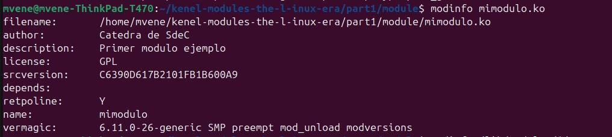
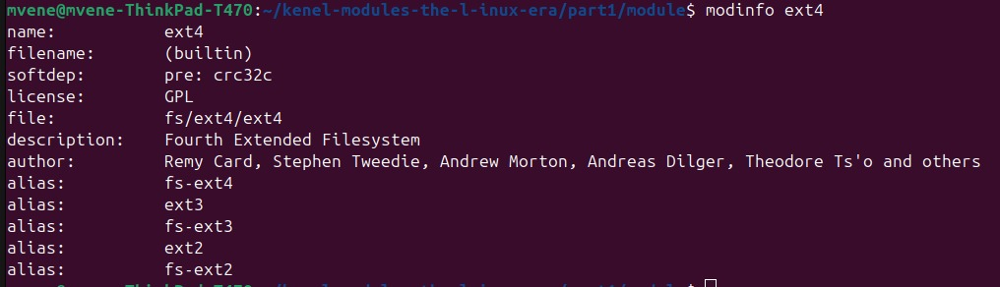
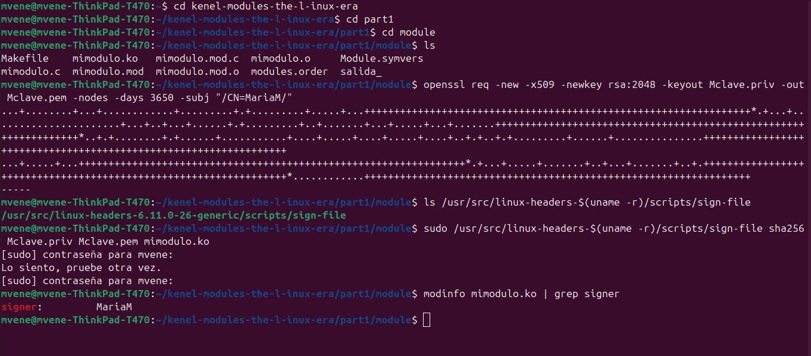
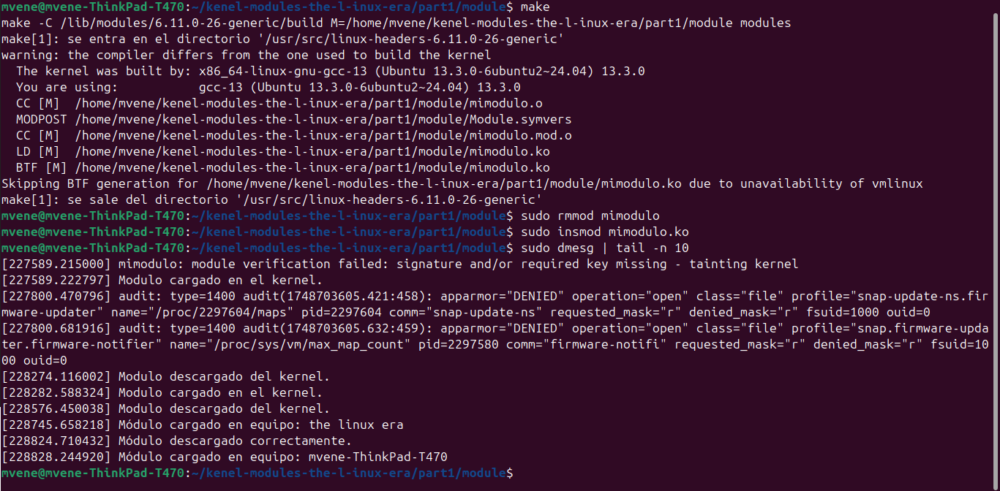

# TP04: Módulos de kernel y llamadas a sistema

## 🎯 Objetivos

## 🔶 Desafíos

### Desafío N°1
### Desafío N°2


### Desafío N°3
#### 1. ¿Qué diferencias se pueden observar entre los dos modinfo? 



Para analizar las diferencias entre un módulo creado manualmente (mimodulo.ko) y uno integrado al sistema (ext4), se utilizó el comando modinfo.

El módulo mimodulo.ko fue desarrollado por la cátedra con fines educativos y presenta una estructura básica. Incluye campos como author, description, license, name, srcversion y vermagic. Todos estos fueron definidos explícitamente en el código fuente, lo cual es común en módulos creados por el usuario. Su ruta (filename) corresponde a un archivo .ko ubicado en el directorio local del proyecto.

En contraste, el módulo ext4 forma parte del kernel de Linux y está embebido directamente en el sistema, lo que se indica con (builtin) en el campo filename. Este módulo tiene una descripción más detallada, múltiples autores reconocidos en el desarrollo de sistemas de archivos, y una serie de alias que permiten su identificación como soporte de distintos tipos de sistemas (ext2, ext3, fs-ext4, etc.). Además, presenta una dependencia previa (softdep: pre: crc32c), lo cual señala la carga anticipada de ciertos módulos antes de su uso.

Esta comparación permite observar cómo los módulos del sistema están más integrados, documentados y optimizados para compatibilidad, mientras que los módulos desarrollados externamente pueden adaptarse a necesidades específicas pero requieren definición manual de sus metadatos.


#### 2. ¿Qué divers/modulos estan cargados en sus propias pc? comparar las salidas con las computadoras de cada integrante del grupo. Expliquen las diferencias. Carguen un txt con la salida de cada integrante en el repo y pongan un diff en el informe.

Cada integrante del grupo generó un archivo con la salida del comando lsmod, que muestra los módulos actualmente cargados en el sistema. Posteriormente, se utilizó la herramienta diff para comparar estas salidas:

```bash

diff salida_mvene.txt salida_ivan.txt > diferencias_mvene_ivan.txt

```

Esta comparación permitió observar diferencias significativas entre las configuraciones de ambos equipos. A continuación se resumen las observaciones más relevantes:

*El equipo de mvene tiene módulos relacionados con:*

- Red e internet: iwlwifi, mac80211, cfg80211 (placa WiFi Intel).

- Audio: snd_hda_codec_realtek, snd_sof, snd_soc_* (controladores de audio integrados).

- Video y cámara: uvcvideo, videobuf2_*, i915 (gráficos Intel), videodev.

- Bluetooth: btusb, btintel, btrtl, bluetooth.

- ThinkPad: thinkpad_acpi, nvram, platform_profile.

- Otros: módulos relacionados con dispositivos Logitech (hid_logitech_*), y soporte para almacenamiento USB (usb_storage, uas).

*El equipo de Iván presenta módulos orientados a:*

- Entorno virtualizado: hyperv_*, hid_hyperv, hv_vmbus, hv_utils, hv_balloon, hv_storvsc, hyperv_fb, lo que indica que probablemente se trata de una máquina virtual ejecutándose en Hyper-V.

- Drivers genéricos y almacenamiento virtual: floppy, pata_acpi, scsi_transport_fc, entre otros.

- Menor cantidad de módulos gráficos, de audio y red, lo que también concuerda con un entorno virtualizado sin necesidad de controladores físicos.

Las diferencias encontradas reflejan cómo el kernel de Linux carga dinámicamente los módulos necesarios según el hardware detectado en cada equipo. En sistemas físicos como el de Milagros, se cargan controladores reales de red, audio, video y dispositivos periféricos. En cambio, en entornos virtuales como el de Iván, el kernel carga módulos de virtualización proporcionados por el hipervisor (Hyper-V en este caso), y omite muchos controladores físicos.


#### 3. ¿Cuáles no están cargados pero están disponibles? que pasa cuando el driver de un dispositivo no está disponible. 

En un sistema Linux, los módulos se cargan dinámicamente según el hardware detectado y la configuración del sistema operativo. Es posible listar todos los módulos disponibles ejecutando:

```bash

find /lib/modules/$(uname -r) -type f -name "*.ko*"

```
Comparando esta lista con los módulos cargados (lsmod), se puede identificar qué controladores están disponibles pero no utilizados.

Cuando el driver de un dispositivo no está disponible (ni cargado, ni presente como .ko), ese hardware no podrá funcionar. Por ejemplo, si no se carga el módulo del adaptador WiFi, el sistema no tendrá conectividad inalámbrica. Esta situación puede deberse a la ausencia de soporte en el kernel, o a una instalación incompleta.

#### 4. Correr hwinfo en una pc real con hw real y agregar la url de la información de hw en el reporte. 

Se utilizó la herramienta hwinfo en una computadora real para obtener un informe detallado del hardware. Esta herramienta permite identificar todos los dispositivos presentes en el sistema (CPU, RAM, placa de video, red, almacenamiento, etc.) y verificar que los módulos del kernel correspondientes estén cargados.

La información completa se encuentra en el siguiente archivo:

- hwinfo_mvene.txt

Y un resumen simplificado en:

- hwinfo_mvene_resumen.txt

Ejemplo de información obtenida:

    - Fabricante: LENOVO

    - Modelo: ThinkPad T470

    - CPU: Intel(R) Core(TM) i5-7300U CPU @ 2.60GHz

    - RAM: 16 GB (Samsung + banco libre)

    - Puertos: USB 1 a 9 (algunos sin dispositivos conectados)

    - Slots: SIM card, media card, etc.

Esta información es útil para verificar que todos los módulos correspondientes a estos dispositivos se hayan cargado correctamente en el sistema (lsmod), y sirve como base para detectar módulos disponibles pero no cargados.

#### 5. ¿Qué diferencia existe entre un módulo y un programa?

Un programa es un conjunto de instrucciones que se ejecuta de forma independiente en espacio de usuario, realizando tareas específicas con recursos propios. En cambio, un módulo es un fragmento de código que se carga dentro del núcleo del sistema operativo (kernel) para ampliar sus funcionalidades, como controladores de dispositivos, y se ejecuta con privilegios elevados. Mientras el programa funciona como una aplicación normal, el módulo actúa como una extensión interna del sistema, cargándose y descargándose dinámicamente sin reiniciar.

#### 6. ¿Cómo puede ver una lista de las llamadas al sistema que realiza un simple helloworld en C?

Para analizar las llamadas al sistema que realiza un programa sencillo en C, como un "Hello World", se puede utilizar la herramienta strace en sistemas Linux. Esta utilidad permite rastrear todas las interacciones del programa con el kernel, mostrando en detalle cada syscall invocada durante la ejecución.

Por ejemplo, al ejecutar:
```bash
    strace ./hello_world
```
se obtiene una lista completa de llamadas al sistema, como execve, que inicia el programa; write, que escribe el texto en la salida estándar; y exit_group, que indica la finalización del proceso. Esta información es útil para comprender el comportamiento interno del programa y cómo interactúa con el sistema operativo.

#### 7. ¿Qué es un segmentation fault? ¿Cómo lo maneja el kernel y como lo hace un programa?

Un segmentation fault (o "fallo de segmentación") es un error que ocurre cuando un programa intenta acceder a una zona de memoria que no tiene permitida, ya sea porque no le pertenece o porque intenta hacerlo de una forma no válida (por ejemplo, escritura en una región de solo lectura o acceso a un puntero nulo).

El kernel detecta este acceso inválido mediante el mecanismo de protección de memoria. Cuando ocurre, se genera una interrupción o excepción que el kernel identifica como una violación de segmentación. En respuesta, el kernel envía una señal al proceso infractor, generalmente SIGSEGV, y termina su ejecución para evitar daños en el sistema o en otros procesos.

Por defecto, un programa que recibe la señal SIGSEGV se finaliza inmediatamente. Sin embargo, un programa puede interceptar esta señal mediante el uso de manejadores personalizados con funciones como signal() o sigaction(). Esto permite, por ejemplo, registrar el error, liberar recursos o mostrar un mensaje antes de terminar. No obstante, la causa del error suele indicar un problema grave en el código, como el uso de punteros no inicializados o el acceso fuera de los límites de un array.

#### 8. ¿Se animan a intentar firmar un módulo de kernel y documentar el proceso?  https://askubuntu.com/questions/770205/how-to-sign-kernel-modules-with-sign-file 



Se procedió a firmar el módulo mimodulo.ko utilizando una clave RSA personalizada. Se generó una clave privada (Mclave.priv) y un certificado público (Mclave.pem), los cuales se utilizaron junto con el script sign-file del kernel. Posteriormente, se verificó la firma con modinfo, comprobando que el módulo quedó firmado correctamente.

#### 9. Agregar evidencia de la compilación, carga y descarga de su propio módulo imprimiendo el nombre del equipo en los registros del kernel. 

Se modificó el módulo mimodulo.ko para que, al ser cargado, imprimiera en el log del kernel el nombre del equipo. Para esto se utilizó la función utsname()->nodename, que permite acceder al hostname del sistema desde código en espacio de kernel.

El módulo fue compilado y cargado correctamente utilizando insmod. Luego, se verificó la impresión del mensaje en los registros del kernel mediante:+

```bash
    sudo dmesg | tail -n 10
```
La salida fue la siguiente:



el archivo mimodulo.c quedo de la siguiente manera:
 
```bash
    #include <linux/module.h>
    #include <linux/kernel.h>
    #include <linux/utsname.h>

    int init_module(void)
    {
        printk(KERN_INFO "Módulo cargado en equipo: %s\n", utsname()->nodename);
        return 0;
    }

    void cleanup_module(void)
    {
        printk(KERN_INFO "Módulo descargado correctamente.\n");
    }

    MODULE_LICENSE("GPL");
```

#### 10. ¿Qué pasa si mi compañero con secure boot habilitado intenta cargar un módulo firmado por mi? 

Si mi compañero tiene habilitado Secure Boot e intenta cargar un módulo del kernel que fue firmado por mí, el sistema rechazará el módulo por defecto. Esto se debe a que Secure Boot solo permite la carga de módulos que estén firmados con una clave reconocida por el firmware UEFI del sistema. Como mi clave privada no está registrada en su sistema, el módulo se considera no confiable y es bloqueado por el kernel, generando errores al intentar insertarlo.

Para poder cargarlo, mi compañero debería importar mi clave pública al sistema mediante mokutil, lo cual requiere registrar la clave en el gestor MOK (Machine Owner Key). Durante el siguiente reinicio, se solicitará aceptar manualmente la incorporación de la clave a través del menú de arranque. Solo después de ese paso el módulo podrá ser cargado con Secure Boot habilitado.

Esta restricción tiene como objetivo proteger el proceso de arranque y el kernel de código no autorizado, asegurando que solo se ejecute software firmado por entidades confiables.

#### 11. Dada la siguiente nota https://arstechnica.com/security/2024/08/a-patch-microsoft-spent-2-years-preparing-is-making-a-mess-for-some-linux-users/

#### a) ¿Cuál fue la consecuencia principal del parche de Microsoft sobre GRUB en sistemas con arranque dual (Linux y Windows)?

En agosto de 2024, Microsoft lanzó una actualización de seguridad destinada a corregir una vulnerabilidad en el cargador de arranque GRUB, utilizada comúnmente en sistemas Linux. Sin embargo, esta actualización tuvo un efecto no deseado en sistemas con arranque dual (Windows y Linux) que tenían habilitado Secure Boot. Muchos usuarios experimentaron errores al intentar iniciar Linux, recibiendo mensajes como "Verifying shim SBAT data failed: Security Policy Violation". 

#### b) ¿Qué implicancia tiene desactivar Secure Boot como solución al problema descrito en el artículo?

Desactivar Secure Boot permite que el sistema cargue software no firmado o que no cumple con las políticas de firma digital establecidas por el firmware. Aunque esto puede resolver el problema de arranque de Linux causado por la actualización de Microsoft, también reduce la seguridad del sistema al permitir la ejecución de software potencialmente no confiable durante el proceso de arranque.

#### c) ¿Cuál es el propósito principal del Secure Boot en el proceso de arranque de un sistema?

Secure Boot es una característica de seguridad del firmware UEFI que garantiza que solo se ejecute software firmado y confiable durante el proceso de arranque. Su objetivo principal es proteger el sistema contra malware y rootkits que podrían cargarse antes del sistema operativo, asegurando que el software de arranque no haya sido alterado y provenga de una fuente legítima.