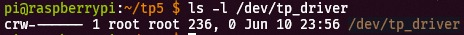
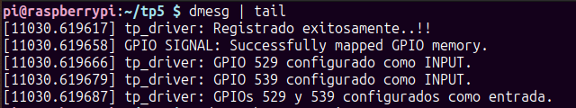
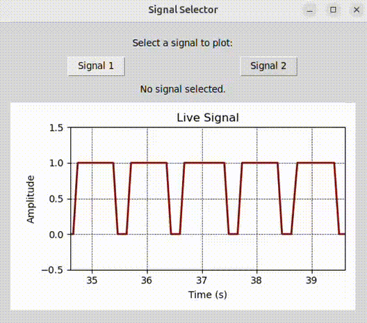

# TP05: Device drivers

## 1. Introducción
 
En el ámbito de la interacción hardware-software, los drivers de dispositivos actúan como el puente esencial que permite a los sistemas operativos comunicarse y controlar los periféricos conectados. Este informe detalla el diseño y la implementación de un Character Device Driver (CDD) para una Raspberry Pi 4, denominado tp_sensor_driver.c, junto con una aplicación de usuario en Python, user_app.py. El objetivo principal es sensar y visualizar dos señales externas, generadas en este caso por un Arduino, a través de los pines GPIO de la Raspberry Pi, permitiendo al usuario seleccionar cuál de las señales desea monitorear y graficar en tiempo real.

## 2. Fundamentos de un Driver de Dispositivo de Carácter

Un driver de dispositivo de carácter es un tipo de driver de Linux que maneja dispositivos que transfieren datos como un flujo de bytes, sin estructura de bloques. Son ideales para dispositivos como puertos seriales, teclados o, en nuestro caso, entradas GPIO. La interacción con estos drivers se realiza a través de operaciones de archivo estándar como open(), read(), write(), y ioctl().

## 3. Diseño e Implementación del Driver de Carácter (tp_sensor_driver.c)

El ``tp_sensor_driver.c`` es el corazón de este proyecto, encargado de interactuar directamente con los pines GPIO de la Raspberry Pi 4.

### 3.1. Definiciones y Configuración Inicial

**Inclusión de cabeceras:** Se incluyen las cabeceras necesarias para el desarrollo de módulos de kernel de Linux, acceso a memoria, manejo de dispositivos de carácter e ioctl.

**Comandos ioctl:** 

Se definen dos comandos ioctl:

- **TP_SELECT_SIGNAL1:** Para seleccionar la lectura de la Señal 1.

- **TP_SELECT_SIGNAL2:** Para seleccionar la lectura de la Señal 2.

Estos comandos utilizan un "número mágico" (TP_IOC_MAGIC 'k') para evitar colisiones con otros comandos del sistema.

**Variables Globales:**

- **current_signal:** Una variable clave que almacena qué señal (1 o 2) está actualmente seleccionada para ser leída. Inicialmente, se establece en 1.

- **first, c_dev, cl:** Variables estándar para el registro del dispositivo de carácter en el sistema Linux (número de dispositivo mayor/menor, estructura cdev, y clase de dispositivo).

### 3.2. Mapeo de Memoria GPIO

Dado que los pines GPIO en la Raspberry Pi se controlan a través de registros de memoria, el driver necesita mapear esta región de memoria al espacio de direcciones virtuales del kernel.

**Direcciones Base:** Se definen BCM2711_PERI_BASE y GPIO_BASE para la Raspberry Pi 4 (BCM2711).

**GPIO_SIZE:** El tamaño de la región de memoria GPIO a mapear es crucial para acceder a los registros de selección de función (GPFSEL) y de nivel de entrada (GPLEV).

**gpio_base_addr:** Un puntero a la dirección de memoria virtual mapeada, obtenido mediante ioremap(), lo que permite al driver acceder a los registros GPIO como si fueran variables en memoria.

### 3.3. Control de Pines GPIO

El driver incluye funciones auxiliares para manipular los pines GPIO:

- **gpio_set_input(unsigned int gpio_num):** Esta función configura un pin GPIO específico como entrada. Esto se logra modificando los bits correspondientes en los registros GPFSEL (GPIO Function Select).

- **gpio_get_level(unsigned int gpio_num):** Lee el estado actual (alto o bajo, 1 o 0) de un pin GPIO de entrada. Accede al registro GPLEV0_OFFSET (GPIO Pin Level 0) y extrae el bit correspondiente al pin.

### 3.4. Operaciones de Archivo (file_operations)

El driver implementa las operaciones de archivo estándar que permiten a las aplicaciones de usuario interactuar con él:

- **my_open(struct inode i, struct file f):** Se llama cuando la aplicación de usuario abre el dispositivo ``(/dev/tp_driver)``. Simplemente registra un mensaje en el kernel.

- **my_close(struct inode i, struct file f):** Se llama cuando la aplicación de usuario cierra el dispositivo. También registra un mensaje.

- **my_read(struct file f, char __user buf, size_t len, loff_t off):** Esta es la función clave para la lectura de datos.
Determina qué pin GPIO leer basándose en el valor de ``current_signal``.
Llama a ``gpio_get_level()`` para obtener el estado actual del pin.
Convierte el nivel GPIO (0 o 1) a un carácter ('0' o '1').
Utiliza ``copy_to_user()`` para transferir el carácter al búfer de la aplicación de usuario.

- **my_write(struct file f, const char __user buf, size_t len, loff_t off):** Aunque no es utilizada activamente para controlar el hardware en este diseño, está presente como parte de las operaciones de archivo estándar. Simplemente registra un intento de escritura.

- **tp_sensor_ioctl(struct file f, unsigned int cmd, unsigned long arg):** Maneja los comandos ioctl de la aplicación de usuario.
Reinicia f->f_pos a 0 para asegurar un comportamiento consistente.
Si el comando es TP_SELECT_SIGNAL1, establece current_signal a 1.
Si el comando es TP_SELECT_SIGNAL2, establece current_signal a 2.
Registra mensajes informativos sobre la señal seleccionada.

### 3.5. Funciones de Inicialización y Salida del Módulo

- **tp_driver_init(void):** La función de inicialización del módulo.
Asigna dinámicamente un número de dispositivo de carácter.
Mapea la memoria GPIO usando ioremap().
Configura los pines SIGNAL1_GPIO y SIGNAL2_GPIO (pines 529 y 539, equivalentes a GPIO17 y GPIO27 en el BCM2711) como entradas.
Crea una clase de dispositivo y un nodo de dispositivo (/dev/tp_driver) para que la aplicación de usuario pueda acceder al driver.
Inicializa y añade el cdev con las operaciones de archivo definidas.

- **tp_driver_exit(void):** La función de salida (limpieza) del módulo.
Desregistra el cdev, destruye el dispositivo y la clase. Desmapea la memoria GPIO usando iounmap() para liberar los recursos.

## 4. Diseño e Implementación de la Aplicación de Usuario (user_app.py)
La aplicación ``user_app.py`` es una interfaz gráfica de usuario (GUI) desarrollada con Tkinter y Matplotlib que interactúa con el driver para sensar y visualizar las señales.

### 4.1. Interacción con el Driver

- **Apertura del Dispositivo:** La aplicación abre el dispositivo /dev/tp_driver en modo lectura/escritura (os.O_RDWR).

- **Comandos ioctl:** Recrea las definiciones de los comandos ioctl del driver (TP_SELECT_SIGNAL1, TP_SELECT_SIGNAL2) y utiliza fcntl.ioctl() para enviarlos al driver, indicándole qué señal debe leer.

- **Lectura de Señales:** La función os.read(self.device, 1) se encarga de leer un byte del driver. Este byte será '0' o '1', representando el estado del pin GPIO.

### 4.2. Interfaz de Usuario y Gráficos

- **tkinter:** Utilizado para construir la interfaz gráfica, incluyendo botones para seleccionar las señales y etiquetas de estado.

- **matplotlib:** Integrado con Tkinter (FigureCanvasTkAgg) para generar y mostrar el gráfico en tiempo real.
Se configura el título, etiquetas de los ejes (Time (s) en abscisas, Amplitude en ordenadas), y colores del gráfico.
La línea del gráfico (self.line) se actualiza continuamente con los nuevos puntos de datos.

- **update_loop():** Un hilo separado (threading.Thread) ejecuta esta función para realizar la lectura continua del driver y actualizar los datos del gráfico sin bloquear la interfaz de usuario.

- **start_signal(self, signal_id):**
Se invoca cuando el usuario selecciona una señal (1 o 2).
Borra los datos previos del gráfico (signal_data y time_data).
Reinicia el tiempo de inicio (start_time).
Envía el comando ioctl correspondiente al driver para que cambie la señal a leer.

- **update_plot():** Actualiza los datos de la línea del gráfico y ajusta los límites del eje X para mostrar una ventana temporal deslizante de las últimas 500 muestras. El eje Y se fija entre -0.5 y 1.5, lo cual es adecuado para señales binarias (0 o 1).

## 5. Configuración y Ejecución

Para poner en marcha este sistema, se siguieron los siguientes pasos generales:

- **Generación de Señales (Arduino):** El Arduino se programó para generar las dos señales digitales (pulsos cuadrados con distintos duty cycle) en los pines correspondientes que se conectarán a los GPIO 17 y 27 de la Raspberry Pi.

  Script de Arduino:

  ````

  const int pinA = 9; 
  const int pinB = 10; 

  void setup() {
    pinMode(pinA, OUTPUT);
    pinMode(pinB, OUTPUT);
  }

  void loop() {

    digitalWrite(pinA, HIGH); 
    digitalWrite(pinB, HIGH); 
    delay(250);
    digitalWrite(pinA, LOW); 
    delay(500);
    digitalWrite(pinB, LOW);   
    delay(250);
  }
  ````

- **Cableado:** Se conectaron los pines de salida del Arduino que generan las señales a los pines GPIO 17 (Signal 1) y GPIO 27 (Signal 2) de la Raspberry Pi.

<p align="center">


<p>

- **Conexión a la Raspberry Pi:** 
La forma más común de conectarse a la Raspberry Pi para trabajar es a través de SSH (Secure Shell). Se escaneó la red local para descubrir dispositivos, utilizando la herramienta nmap en Linux con un comando como nmap -sn 192.168.1.10/24, donde 192.168.1.10/24 representaba la subred a escanear. 
Desde la computadora principal Linux, se abrió una terminal y se utilizó el comando ssh ``ssh -X pi@<dirección_ip_raspberry>``. La contraseña predeterminada fue raspberry.
Se aseguró que SSH estuviera habilitado en la Raspberry Pi (pudo hacerse desde raspi-config).

- **Compilación del Driver:** Compilar ``tp_sensor_driver.c`` en la Raspberry Pi utilizando el toolchain del kernel.

- **Carga del Módulo:** Se carga el driver en el kernel con ``sudo insmod tp_sensor_driver.ko``. Esto creará el nodo de dispositivo ``/dev/tp_driver``.

<p align="center">

  

</p>

    A continuación se muestra la salida del comando ``dmesg | tail`` ejecutado en la terminal de la Raspberry Pi después de la carga del módulo del driver (``tp_sensor_driver.ko``). Este comando permite visualizar los últimos mensajes del kernel log, donde se registran los estados y operaciones importantes.

    Como se observa, el driver ``tp_driver`` informó de su registro exitoso. Posteriormente, se confirmó el mapeo correcto de la memoria GPIO. Finalmente, los mensajes tp_driver: GPIO 529 configurado como INPUT y tp_driver: GPIO 539 configurado como INPUT verificaron que los pines GPIO designados para las señales (GPIO 17 y GPIO 27 respectivamente) fueron correctamente inicializados como entradas, listos para sensar las señales externas.

<p align="center">

  

</p>

- **Ejecución de la Aplicación y Visualización Remota:**
Para ver la ventana gráfica de ``user_app.py`` sin necesidad de conectar un monitor a la Raspberry Pi, se utilizó la redirección X11 (X Forwarding) a través de SSH.
En la terminal local (no en la de la Raspberry Pi), se realizó la conexión usando ``ssh -X pi@<dirección_ip_raspberry>``. El parámetro -X fue esencial para habilitar la redirección de aplicaciones gráficas X11 desde la Raspberry Pi hacia la máquina cliente. Esto significa que la interfaz gráfica de ``user_app.py``, que es una aplicación X11, se visualizó en el monitor de la computadora local, mientras que la aplicación se ejecutaba realmente en la Raspberry Pi.

    Una vez conectado por SSH con X Forwarding habilitado, se pudo ejecutar la aplicación en la Raspberry Pi: ``python3 user_app.py``. La ventana gráfica de la aplicación apareció en el monitor de la computadora local.

<p align="center">


<>/p

## 6. Conclusión

Este proyecto demuestra con éxito el desarrollo de un driver de carácter personalizado para Linux y su integración con una aplicación de usuario para la lectura y visualización de señales GPIO generadas por un Arduino en tiempo real. La implementación cumple con los requisitos de la consigna al permitir la selección y el graficado dinámico de dos señales externas, sirviendo como una base sólida para futuros desarrollos en la interacción hardware-software a bajo nivel.
